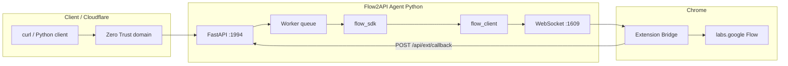

# Flow2API — Python (cài đặt từ source)

Ứng dụng Python thay thế `Flow2API-Agent.exe`, tương thích **Chrome Extension Bridge** và **Dashboard** có sẵn trong repo.

## Kiến trúc (phân tích từ source hiện tại)



| Thành phần | Vai trò |
|-----------|---------|
| **Extension** (`extension/`) | Bắt Bearer `ya29.*`, giải reCAPTCHA, proxy `aisandbox-pa.googleapis.com` |
| **Agent HTTP** | API công khai: `POST/GET /api/requests`, health, admin keys |
| **Agent WS** `ws://127.0.0.1:1609` | Extension kết nối, nhận `api_request` / `trpc_request` |
| **Callback** `POST /api/ext/callback` | Extension trả kết quả (header `X-Callback-Secret`) |
| **Worker** | Xử lý hàng đợi: `gen_image`, `gen_text_video`, `gen_video`, … |
| **Dashboard** (`frontend/dashboard.html`) | UI Generate / Tasks / API Builder |
| **Admin** `/admin` | Tạo API key `f2api_...` |

### Cổng mặc định

| Dịch vụ | Port | Ghi chú |
|---------|------|---------|
| HTTP API + Dashboard | **1994** | Extension manifest trỏ `1994` |
| WebSocket extension | **1609** | `AGENT_WS_URL` trong `extension/background.js` |

Nếu bạn muốn **1993** (như ví dụ curl), đặt biến môi trường và cập nhật extension:

```powershell
set FLOW2API_HTTP_PORT=1993
```

Sửa `extension/background.js`: `CALLBACK_URL` → `http://127.0.0.1:1993/api/ext/callback` và `manifest.json` host_permissions.

## Cài đặt (Windows)

1. Cài [Python 3.11+](https://www.python.org/downloads/)
2. Mở Chrome → `chrome://extensions` → Load unpacked → chọn thư mục `extension/`
3. Đăng nhập [Google Flow](https://labs.google/fx/tools/flow) (để extension bắt token)
4. Trong thư mục `python-app`:

```bat
install.bat
run.bat
```

5. Tạo API key: http://127.0.0.1:1994/admin (mặc định `admin` / `admin`)
6. Mở dashboard: http://127.0.0.1:1994/

## Gọi API (giống API Builder trên UI)

### Tạo ảnh

```bash
curl -X POST "http://127.0.0.1:1994/api/requests" ^
  -H "Authorization: Bearer f2api_YOUR_KEY" ^
  -H "Content-Type: application/json" ^
  -d "{\"type\":\"gen_image\",\"params\":{\"prompt\":\"A cinematic fashion photo, realistic lighting\",\"aspect_ratio\":\"16:9\",\"image_model\":\"NANO_BANANA_PRO\",\"variant_count\":1}}"
```

### Kiểm tra trạng thái

```bash
curl -H "Authorization: Bearer f2api_YOUR_KEY" "http://127.0.0.1:1994/api/requests/REQUEST_ID"
```

Khi `status=done`, response có:

| Field | Mô tả |
|-------|--------|
| `result.image_urls` / `result.video_urls` | URL công khai HTTPS (frontend dùng trực tiếp, **không** cần Bearer) |
| `result.Link` | URL chính (ảnh/video đầu tiên) |
| `result.media_ids` | Dùng cho upscale 2K/4K / 1080p |
| `result.project_id` | Project Flow (upscale) |

URL ổn định theo `request_id` (không cần auth):

- Ảnh: `GET /image/{REQUEST_ID}` (thêm `/0`, `/1`, … nếu nhiều ảnh)
- Video: `GET /video/{REQUEST_ID}`

Tải file gốc (attachment, cần Bearer):

```bash
curl -H "Authorization: Bearer f2api_YOUR_KEY" ^
  "http://127.0.0.1:1994/api/requests/REQUEST_ID?download=true" ^
  -o output.jpg
```

### Tải ảnh 2K / 4K (upscale)

Sau khi tạo ảnh xong, gọi upscale với `target_resolution`:

| Giá trị | Mô tả |
|---------|--------|
| `2k` hoặc `UPSAMPLE_IMAGE_RESOLUTION_2K` | Upscale 2K |
| `4k` hoặc `UPSAMPLE_IMAGE_RESOLUTION_4K` | Upscale 4K (mặc định) |

```bash
curl -X POST "http://127.0.0.1:1994/api/requests/upsample-image" ^
  -H "Authorization: Bearer f2api_YOUR_KEY" ^
  -H "Content-Type: application/json" ^
  -d "{\"request_id\":\"REQUEST_ID\",\"target_resolution\":\"UPSAMPLE_IMAGE_RESOLUTION_2K\"}"
```

Hoặc truyền trực tiếp `media_id` từ `result.media_ids[0]`:

```bash
curl -X POST "http://127.0.0.1:1994/api/requests/upsample-image" ^
  -H "Authorization: Bearer f2api_YOUR_KEY" ^
  -H "Content-Type: application/json" ^
  -d "{\"media_id\":\"MEDIA_UUID\",\"project_id\":\"PROJECT_UUID\",\"target_resolution\":\"2k\"}"
```

Tải thẳng file ảnh (không JSON): thêm query `?download=true`

```bash
curl -X POST "http://127.0.0.1:1994/api/requests/upsample-image?download=true" ^
  -H "Authorization: Bearer f2api_YOUR_KEY" ^
  -H "Content-Type: application/json" ^
  -d "{\"request_id\":\"REQUEST_ID\"}" ^
  -o output_4k.jpg
```

Response JSON mẫu:

```json
{
  "source_media_id": "67df4b95-458d-44c8-927c-ab9a34ebac28",
  "project_id": "53fb4e75-b57e-447d-93a9-d7fa48f9cc36",
  "target_resolution": "UPSAMPLE_IMAGE_RESOLUTION_4K",
  "media_id": "...",
  "image_url": "https://..."
}
```

### Tải video 1080p (upscale)

Sau khi tạo video xong (`gen_text_video` / `gen_image_video`), gọi upscale 1080p. **Bắt buộc** có video đã generate thành công (`status=done`) và **đúng Chrome profile** đã tạo video.

**Quan trọng qua Cloudflare Tunnel** (`flow2.viettheo.site`): upscale mất vài phút — **không** giữ 1 HTTP request mở (sẽ 502 Bad Gateway ~100s). Dùng **async**: POST trả `queued` ngay, poll status, rồi tải file.

```bash
# Bước 1 — enqueue
curl -X POST "https://flow2.viettheo.site/api/requests/upsample-video" ^
  -H "Authorization: Bearer f2api_YOUR_KEY" ^
  -H "Content-Type: application/json" ^
  -d "{\"request_id\":\"VIDEO_TASK_ID_DONE\"}"

# → {"id":"UPSAMPLE_JOB_ID","status":"queued"}

# Bước 2 — poll đến done
curl -H "Authorization: Bearer f2api_YOUR_KEY" ^
  "https://flow2.viettheo.site/api/requests/UPSAMPLE_JOB_ID"

# Bước 3 — tải MP4
curl -H "Authorization: Bearer f2api_YOUR_KEY" ^
  "https://flow2.viettheo.site/api/requests/UPSAMPLE_JOB_ID?download=true" ^
  -o output_1080p.mp4
```

Chỉ dùng `?sync=true` khi gọi **local** (`127.0.0.1`) và chấp nhận chờ trong 1 request.

Response JSON mẫu:

```json
{
  "source_media_id": "c93c41c6-df7f-453a-8cea-ef05342e432e",
  "project_id": "0712be5e-9442-4951-8074-04f45ced1b49",
  "target_resolution": "VIDEO_RESOLUTION_1080P",
  "aspect_ratio": "16:9",
  "media_id": "...",
  "video_url": "https://..."
}
```

Upstream Google Flow gọi `batchAsyncGenerateVideoUpsampleVideo` với `videoInput.mediaId` là video nguồn.

### Python client

```python
from client.flow2api_client import Flow2APIClient

client = Flow2APIClient("http://127.0.0.1:1994", "f2api_...")
job = client.create_image(prompt="A cinematic fashion photo", aspect_ratio="16:9")
task = client.wait(job["id"])
upscaled_2k = client.upsample_image_2k(request_id=job["id"])
upscaled_4k = client.upsample_image_4k(request_id=job["id"])
print(upscaled_2k, upscaled_4k)

# Video 1080p
video_job = client.create_text_video(prompt="...", aspect_ratio="16:9")
video_task = client.wait(video_job["id"], max_attempts=240)
upscaled_1080p = client.upsample_video(request_id=video_job["id"])
print(upscaled_1080p)
```

Hoặc chạy: `python client/example_gen_image.py` / `python client/example_upsample_4k.py` / `python client/example_upsample_1080p.py` (đặt `FLOW2API_TOKEN`).

## Cloudflare Zero Trust

Tunnel trỏ domain (ví dụ `flow2.aitipmart.site`) → `http://127.0.0.1:1994`. Client bên ngoài gọi:

`https://flow2.aitipmart.site/api/requests` với Bearer `f2api_...`.

## Biến môi trường

| Biến | Mặc định |
|------|----------|
| `FLOW2API_HTTP_PORT` | `1994` |
| `FLOW2API_HTTP_HOST` | `0.0.0.0` |
| `FLOW2API_EXT_WS_PORT` | `1609` |
| `FLOW2API_ADMIN_USER` | `admin` |
| `FLOW2API_ADMIN_PASSWORD` | `admin` |
| `FLOW2API_DB` | `python-app/storage/flow2api.db` |

## So với bản `.exe`

Source Python này được **reverse-engineer** từ `Flow2API-Agent.exe` + mở rộng từ [flowkit](https://github.com/crisng95/flowkit). Một số tính năng nâng cao của bản đóng gói (storyboard, vision classify, pipeline đầy đủ) có thể chưa có — lõi **gen_image / gen_text_video** và admin key đã được implement.

## Cấu trúc thư mục

```
python-app/
  flow2api/          # Agent FastAPI + worker + SDK
  client/            # SDK gọi API từ script khác
  run.py / run.bat
  install.bat
  requirements.txt
```
